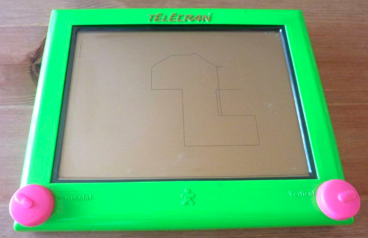

# etch_sketch
replicate etch sketch game using python

[**Wikipedia:**](https://en.wikipedia.org/wiki/Etch_A_Sketch) "Etch A Sketch is a mechanical drawing toy invented by André Cassagnes (Ecran magique, Télécran)(...). An Etch A Sketch has a thick, flat gray screen in a red plastic frame. There are two white knobs on the front of the frame in the lower corners. Twisting the knobs moves a stylus that displaces aluminum powder on the back of the screen, leaving a solid line. The knobs create lineographic images. The left control moves the stylus horizontally, and the right one moves it vertically."

Simple python code using python turtle module to reproduce Etch Sketch's behaviour, using board key as knobs:
'w' = move forward
's' = move backward
'd' = turn clockwise
'a' = turn left
'c' = screen reset (shaking etch sketch 🧚)

